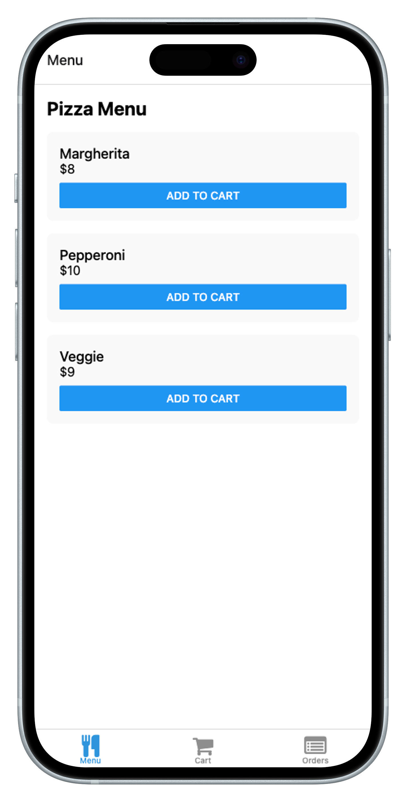
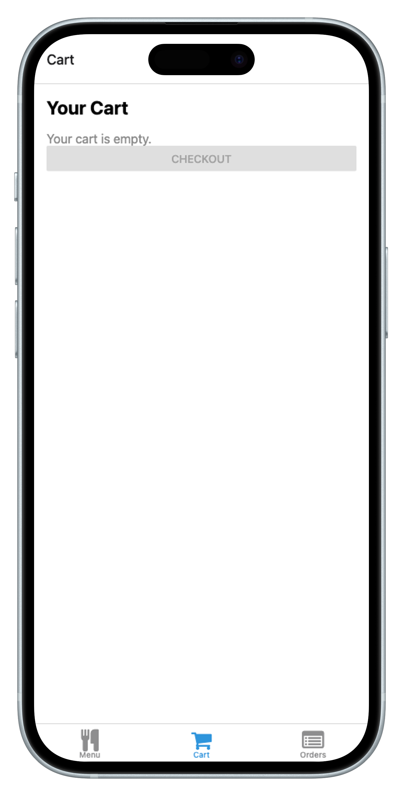
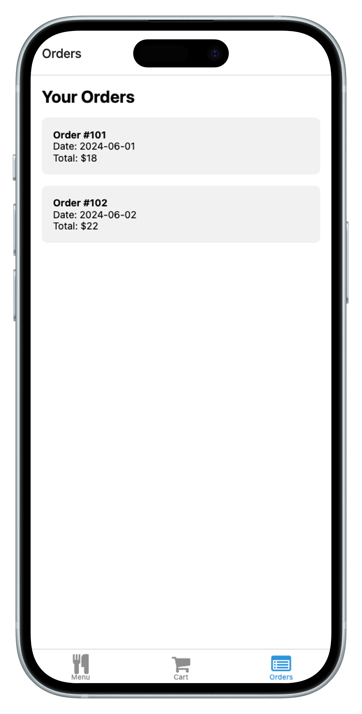

# Order Pizza App

A simple React Native app for ordering pizza, built with Expo and TypeScript.

## Features

- Browse a menu of pizzas
- Add pizzas to your cart
- View and manage your cart
- See your past orders
- Splash screen on app launch

## Getting Started

### Prerequisites

- [Node.js](https://nodejs.org/)
- [Yarn](https://yarnpkg.com/) or [npm](https://www.npmjs.com/)
- [Expo CLI](https://docs.expo.dev/get-started/installation/)

### Installation

```bash
git clone https://github.com/mhshahzad/order-pizza-app.git
cd order-pizza-app
yarn install
# or
npm install
```

### Running the App

```bash
expo start
```

Scan the QR code with the Expo Go app on your device, or run on an emulator.

## Project Structure

- `app/` - Main application code (screens, layouts)
- `assets/` - Images and static assets
- `constants/` - App-wide constants

## Customization

- Replace `assets/images/splash-icon.png` with your own splash image.
- Edit the pizza menu and logic in `app/(tabs)/index.tsx`.

## Screenshots

<p align="center">
  
  
  
  
</p>

## License

MIT
